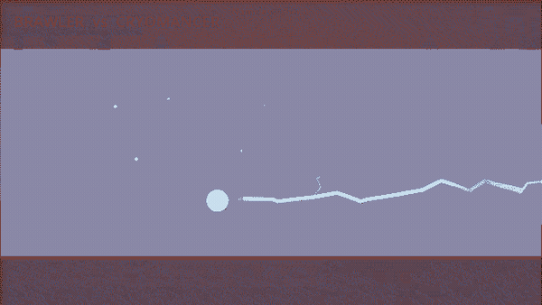

# THE TOWER

**A two-player mobile co-op brawler where stick figures with absurd magic fight up a tower — and friendly fire never turns off.**



*Brawler (yellow) vs Cryomancer (blue), bot-vs-bot. Everything you see is drawn at runtime — there are no character sprites in this project.*

---

## What it is

Two players, two phones, one room. You pick from nine classes, host or join over local wifi, and climb a five-floor tower. Each floor throws escalating waves of mobs at you until the floor is cleared; the last floor spawns a guardian.

Friendly fire is always on, and it is the point. Your spells hit your friend as readily as they hit anything else, and the game names them when it happens. Death is not a loss — you drop to a ghost and stay there until your teammate walks over and revives you. If you both go down, the run is over.

## Design goals

- **Smash-style chaos, bigger arena.** The fighting should be legible at a glance but never tidy. Every attack telegraphs its shape before it lands — the rule is *the shape you can see is the shape that will hurt you*.
- **Friendly fire as a social engine, not a penalty.** The best moments are supposed to be the ones where your friend deletes you by accident and you both see exactly who did it.
- **Bosses with bespoke movesets, some deliberately unfair.** In the spirit of modded Terraria. The four guardians compose from a shared vocabulary of spell shapes, and modifier riders re-skin their behaviour so the same boss is not the same fight twice.
- **Deliberately difficult.** The tower is meant to beat you.

## What's built

- **Combat and classes.** Nine classes (Arcanist, Shadowblade, Brawler, Juggernaut, Cleric, Cryomancer, Stormcaller, Warlock, Swordsaint), each with its own HP, speed, melee and movement verb. 27 distinct carried spell slots.
- **The stick figure rig.** A two-spring procedural rig — gait, ragdoll death, limp and prone collapse — drawn entirely in `_draw`. No sprite sheets.
- **Waves and mobs.** Seven mob archetypes (chaser, brute, caster, charger, summoner, assassin, bomber), elite modifiers, an entity budget, and an ink-scrawl spawn tell before every body arrives.
- **Bosses.** Four — the Ashspire Guardian, the Scribble, the Cartographer, the Illuminator — plus modifier riders that change the fight.
- **Floors.** Five, seeded-randomised, with destructible cover.
- **Co-op.** ENet over LAN with UDP host discovery, so two phones find each other without anyone reading an IP aloud. Host-authoritative world, client-owned heroes, damage applied on the victim's authority. Capped at two players by design.
- **Tooling.** A headless test runner (138 suites green at last run), an in-game director for summoning any boss with any modifiers, a screenshot/capture pipeline, and a bot-vs-bot clip recorder.

## What's next

Honest split — the game is playable on desktop and unproven on a phone:

- **No Android build has ever been made.** The export preset exists; export templates, JDK, SDK and a keystore are all still human steps.
- **Nothing has ever touched a touchscreen.** Every touch constant in the project is a declared guess.
- **Bot fight quality.** Five of the nine classes' bots currently cast nothing — the bot's spell-band scoring only picks long-range options, which the newer short-range signatures fall below.
- **Performance.** ~30 ms CPU at the effect ceiling on desktop, and that figure excludes draw cost. Spell effects are the bottleneck, not the crowd.
- **Audio.** The music tracks are not in this repo (see below), so a fresh clone runs silent.

## Tech

Godot 4.6.2 · GDScript · ENet for co-op · Python for the test runner, capture pipeline and clip recorder · ffmpeg.

No game-art dependencies: the figures, spell spectacles and UI are drawn procedurally.

## Running it

Requires [Godot 4.6](https://godotengine.org/download). No other setup.

```bash
git clone https://github.com/Raebai/Legacy-Frontier.git
cd Legacy-Frontier
# Open godot-project/ in Godot, then press F5.
```

You land on the title screen: **Climb · Free Play · Loadout · Host/Join · Watch Bots**. `F1` in game opens the director (jump floors, summon any boss, switch class live, slow-mo, frame-step).

To run the tests:

```bash
python python-tools/run_all_tests.py --jobs 8
```

**Note on audio:** the score is not committed — the tracks had no recorded licence provenance, so they were untracked before this repo went public. The game handles their absence and runs silent; the two music test suites will fail without them.

---

*Formerly "Legacy Frontier", which was a different game — a top-down RPG with LLM-driven NPCs. That direction was cut and its stack removed. This is what the project is now.*
